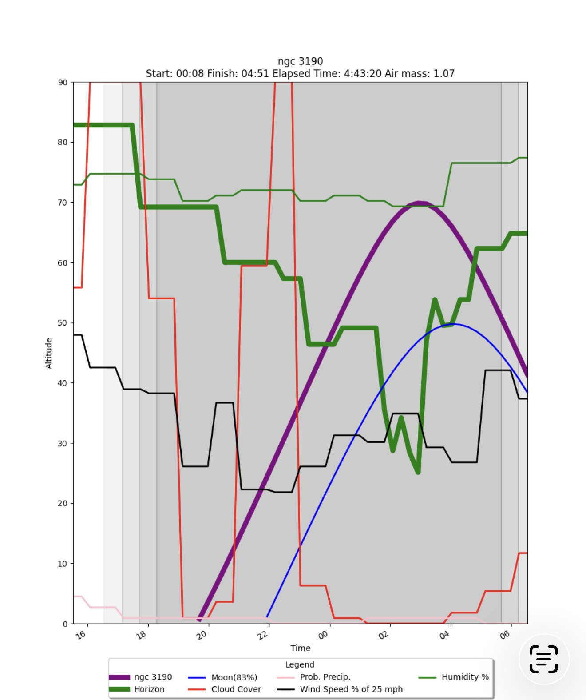
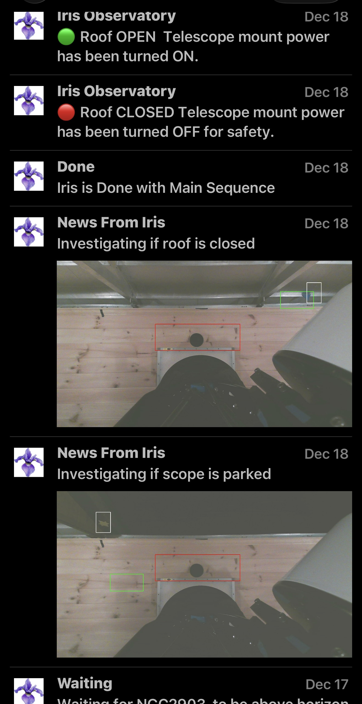
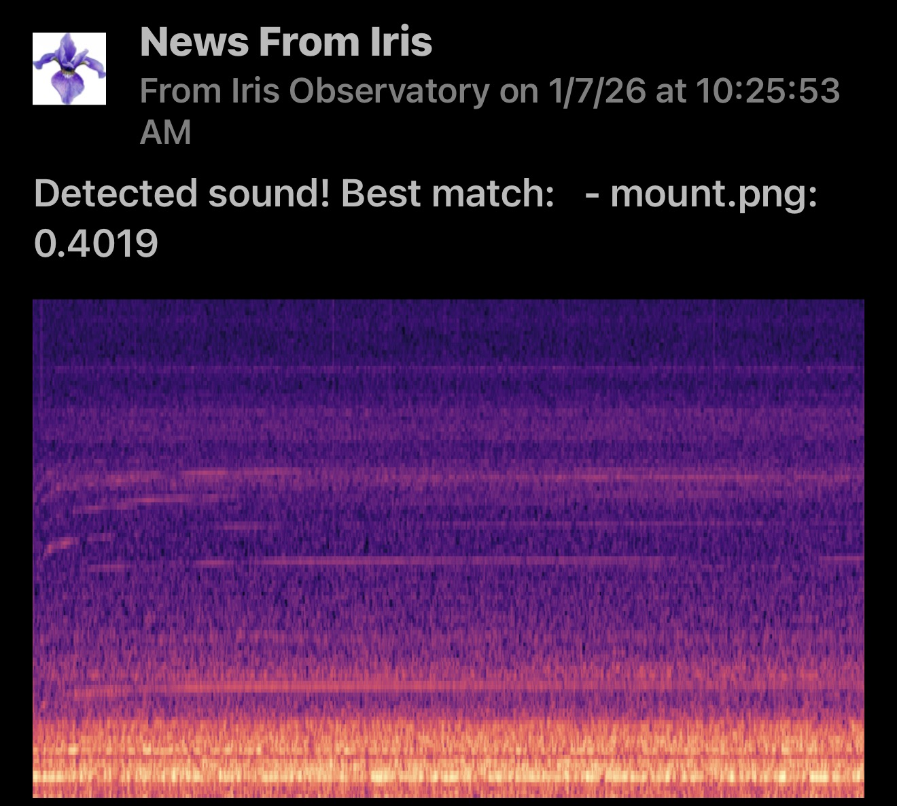

# SRT Social Robotic Telescope
The goal of this project is to remove/reduce human interaction in astronomy. Users interact with the system
through a social messaging services (Currently Mastodon). Users request images of Deep Sky Objects and the system
optimizes each night's imaging based on observability. When complete, the system adds the processed image to its catalog
and alerts the user that it has completed. 
Our goal is to have all this automated, We never want to be in the observatory. This all just happens. 
For now this is very very specific to our observatory, but we hope to generalize it in the future.
The only reason to open source this repo is to allow others using the Observatory to contribute.

- **Architecture**

    - Social Server 
      - Interaction with Social Media (Currently Mastodon)
    - Scheduler
      - Manages the day and evening tasks of the observatory
    - Vision Safety
      - Cameras look for the state of the roof and telescope
    - Audio Safety
      - Microphones compare known good sounds to what is being heard to understand if there is a problem
    - Image Processing
      - Transforming raw images to a pretty picture
    - Servers communicate through mqtt
- 

The user adds a request to the system through Mastodon (`@tmhobservatory@mastodon.social`).For
example  

`@tmhobservatory image m31`  

The User can also ask what is the best night for a specific DSO  

`@tmhobservatory best m31`

Every night the system optimizes the night's imaging based on observability and weather. Below is a graph
displayed to of the night given horizon, and weather conditions.  

The system stops imaging a DSO once the evolution of changes reaches some stopping condition, usually about 20 hours.
A combination of manual and automatic image processing is done, and the resulting image is uploaded to
a [website](https://taylorhogan.github.io) for public viewing. An AI is used to add text to the image to explain the astrophysical context.

There are redundant systems to insure the state of the observatory. This includes cameras, and ultrasonic devices.
Below is a picture of the push notification to the system administrator.

The goal is to have this system run 24/7. Mechanical failures are expected, but these can be mitigated by the use of
automation to analyze the audio and current draw of various components and compare to known
good signatures. Below is a spectrogram of the audio of the mount motors compared to the known good audio.

## My Hardware Block Diagram (very dated)

## Appreciation for others
This work rest heavily on others
- Allsky
- Astroplan
- Astropy
- Mastodon
- N.I.N.A
- Pixinsight

## How to build on linux/mac
Install uv ( a package manager for Python, similar to pip) 
https://uv.readthedocs.io/en/latest/installation.html 

`curl -LsSf https://astral.sh/uv/install.sh | sh`

Exit shell and reopen new shell, otherwise uv will not be in your path   
Download the repo in a location of your choosing

`git clone https://github.com/taylorhogan/srt.git`  

go into the repo

`cd srt`  

Create a virtual environment (only needed once)  

`uv venv venv`   

Activate the virtual environment   
follow the commands from uv above to activate the virtual environment

`source venv/bin/activate`

Install the requirements (dragons be here)

`uv pip install -r requirements.txt`

copy the blank private config file, utlimately this will be a private config file

`cd configs`

`cp configs_blank_private.py configs_private.py`

to test the sound compare feature

`cd sentry`

`python audio_compare.py`

now make some noise for 10 seconds

