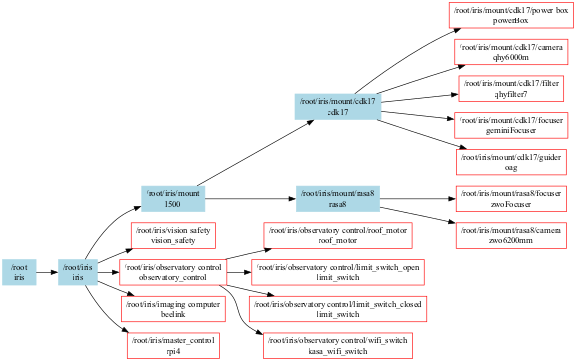

# Iris — a robotic telescope you talk to

Text Iris the name of a nebula from your phone. Some clear night — maybe tonight,
maybe next week when the geometry is right — a roof in a backyard opens on its
own, a half-ton telescope wakes up, finds the target, and spends the dark hours
collecting photons that left their source before the pyramids were built. By
breakfast there's a finished, denoised picture on your phone, captioned with how
many frames survived the night's quality gate. Nobody was in the observatory.
Nobody was awake.

That's the whole idea: **a fully autonomous deep-sky observatory run by
conversation**, built on one stubborn principle — *measure it, or it isn't
true*. Every subsystem below exists because a measurement demanded it, and most
of them have caught at least one thing that "looked fine."

The pictures and the experiment write-ups live at
**[irisscience.org](https://irisscience.org)** — including a live page showing
what the observatory is doing *right now*, down to which state of its night
state machine it's standing in.

---

## Things Iris has actually done

- **Detected an exoplanet.** A 7-hour photometric run on HAT-P-32 caught the
  transit of HAT-P-32b; the blind search pipeline ranked it #1 out of 622 stars
  by box-fit score, exactly where it belonged.
- **Imaged for 12 hours across four nights, unattended, and knew when to
  stop.** Iris measures each target's stack-convergence curve per filter and
  stops scheduling a filter once more frames stop helping — the plan calls it
  auto-stop, and it already flags finished targets the queue thinks are open.
- **Trained a denoiser on its own sky.** A Noise2Noise U-Net (no clean
  reference exists, so it learns from pairs of noisy stacks) trained on this
  telescope's own frames, running nightly on a GPU box. Display only, by rule:
  every number ever quoted comes from the calibrated linear stacks, never the
  pretty picture.
- **Caught its own tooling lying.** The FITS headers revealed the guider's
  dither was silently dead in one axis for months — commands issued, motion
  erased. The mount was exonerated by direct measurement (a cos(dec) trap made
  a flawless offset look 45% short) and the dither now runs through the
  mount's native API. Written up, with the measurements, on the lab site.
- **Predicted rain before the forecast did.** The $25 sky camera's
  central-sky motion detector called a real storm 25–40 minutes ahead of the
  weather API on the night it mattered. The same camera has been
  plate-solved to 1.5 px, so any pixel converts to alt/az and limiting
  magnitude is a measurable, loggable quantity.
- **Learned what actually predicts its seeing.** Nine nights of star-width
  data against weather models: the jet stream barely correlates (ρ = +0.33);
  850 hPa wind (ρ = +0.87) and humidity (ρ = −0.88, humid nights are *sharp*
  here) run the show. The nightly plan report uses those, not folklore.
- **Heard its roof failing before it failed.** Every roof move is
  fingerprinted twice — a mel-spectrogram of its sound and a watt-by-watt
  power trace. A live stall watchdog cut motor power on a real
  gear-didn't-engage event; drift against golden reference moves is judged
  every morning so slow degradation can't hide inside a rolling average.

---

## How a night works

1. **Noon** — the scheduler scores every queued target by visibility window,
   air mass, priority, and *measured need*: filters are weighted by each
   target's per-filter convergence record, so a channel that's never been
   imaged gets the largest share and a converged one gets zero.
2. **Pre-sunset** — weather, safety flag, and a camera snapshot are re-checked.
   A Sonos announcement warns anyone inside that the roof is about to move.
3. **Roof open** — only after computer vision confirms the scope is parked.
   The two hardware laws are absolute and enforced in code: *the roof never
   moves unless the scope is confirmed parked; the scope never moves unless
   the roof is confirmed open.*
4. **The run** — cool, slew, plate-solve, autofocus, then light frames all
   night with a randomized dither between subs. Every incoming frame is
   analysed (FWHM, eccentricity, star count, sky brightness) and streamed to
   the chat ticker and the public live page in real time.
5. **Dawn** — flats, park, roof close, dehumidifier on, summary posted. A GPU
   box picks up the night's frames, stacks, denoises, and pushes the finished
   picture to a phone.

Meanwhile a second brain — a formally specified state machine, defined as a
data table with every state × event pair tested (a 1,944-case sweep proves the
roof invariant over the entire sensor-evidence space) — shadows the whole night
read-only, journaling every transition and every decision the new safety guards
*would* have made. When it has proven itself against enough real nights, it
takes over. Deploys are gated the same way: the observatory pulls a `release`
branch that only advances when CI is green, so a broken push can never reach
the roof controls.

---

## Talking to it

The chat runs on a self-hosted web server (excellent from a phone) with live
job cards, frame previews, and cancellable long commands. A taste:

| Command | What happens |
|---|---|
| `image <dso>` | Queue a target; it gets scheduled when its night comes |
| `tonight` | Tonight's plan — target, hours, weather, moon, even visible ISS passes that cross the sky camera (which get recorded automatically) |
| `stats` / `latest` | Per-frame quality plots; the most recent sub, annotated |
| `snr <dso>` | Stack-convergence curves — is this target *done*? |
| `optics` | Per-star Gaussian fits → FWHM heatmap, coma, tilt, and collimation scores from a single frame |
| `filters <dso> ...` | Explicit per-filter exposure plan for a target |
| `process <dso> <recipe>` | Calibrated LRGB / HOO / SHO stack on demand |
| `transit <star>` | Photometric time series and box-fit transit search |
| `audio <dir> <verdict>` | Label a roof-move spectrogram into the reference library |
| `safe!` / `stop!` | The human veto, always |

---

## The parts

| Subsystem | What it does |
|---|---|
| Scheduler | Noon planning → pre-sunset checks → imaging → shutdown state machine |
| `iris/core` | The next-generation machine-as-data + journal + guards, running in shadow |
| Vision safety | OpenCV template matching: scope parked? roof open? — gates every move |
| Frame watcher | Live FWHM / eccentricity / sky analysis of every sub as it lands |
| Sequence generator | Patches N.I.N.A JSON templates with target, coordinates, and the need-weighted filter plan |
| Stacker | Bias/dark/flat calibration, quality gate, astroalign registration, tiled sigma-clip that levels frames to a common sky (skipping that step measured **8× worse than the photon limit**) |
| Audio + current sentry | Spectrogram matching and power-signature analysis of every roof move, plus the live stall watchdog |
| Sky cameras | An all-sky fisheye and a plate-solved consumer cam: cloud cover, rain detection, star counts, limiting magnitude |
| Publisher | Pushes the live page — skymap, latest sub, per-filter frame counts, and the night's state machine with the current state lit |
| N2N | Noise2Noise training and nightly inference on a DGX Spark |

Hardware: PlaneWave CDK on an L-500 direct-drive mount, 61 MP full-frame mono
camera with a 7-filter wheel, a sliding roof driven by a gate-opener motor,
TP-Link/Shelly switched power, cameras and a microphone as senses — all behind
Tailscale, with the public face served through a Cloudflare tunnel.



---

## Setup

```bash
# Install uv (once)
curl -LsSf https://astral.sh/uv/install.sh | sh

# Clone the repo
git clone https://github.com/taylorhogan/srt.git
cd srt

# Create and activate virtualenv (Python 3.13+).
# Use uv's default .venv path — `uv pip` auto-discovers it; a differently
# named venv is silently ignored and parts of the pipeline degrade quietly.
uv venv --python 3.13
source .venv/bin/activate

# Install dependencies
uv pip install -r requirements.txt

# Create private config (required before running anything)
cp configs/config_blank_private.py configs/config_private.py
# Then fill in API keys/tokens in config_private.py
```

## Running

```bash
# Start both the chat server and the scheduler together
python end_points/start_srt.py

# Or run individually:
python end_points/scheduler_server.py   # Nightly state machine
python cmd_processing/social_server.py  # Web chat server
```

---

## Appreciation

This work rests heavily on others:
- [Astropy](https://www.astropy.org) / [Astroplan](https://astroplan.readthedocs.io)
- [N.I.N.A](https://nighttime-imaging.eu)
- [astroalign](https://astroalign.quatrope.org) / [SEP](https://sep.readthedocs.io)
- [Noise2Noise](https://arxiv.org/abs/1803.04189) (Lehtinen et al., 2018)
- [PixInsight](https://pixinsight.com)
- [Allsky](https://github.com/thomasjacquin/allsky)

---

*Iris Observatory · Social Robotic Telescope · nobody is awake, and the roof
just opened anyway*
